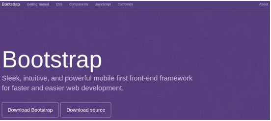
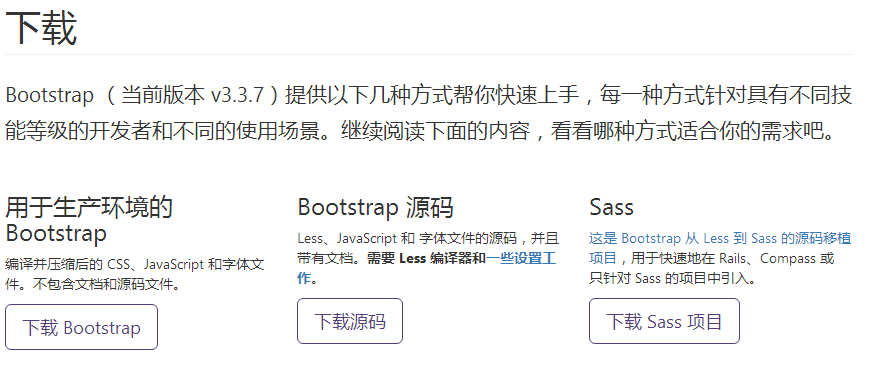
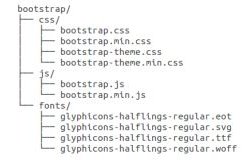
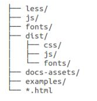

## 附.Bootstrap概要

### Bootstrap简介

Bootstrap，来自Twitter，是目前最受欢迎的前端框架。Bootstrap是基于HTML、CSS、JAVASCRIPT的，它简洁灵活，使得Web开发更加快捷。

#### 什么是Bootstrap

Bootstrap是一个用于快速开发Web应用程序和网站的前端框架。Bootstrap是基于HTML、CSS、JAVASCRIPT的。

#### 为什么使用Bootstrap

移动设备优先：自Bootstrap3起，框架包含了贯穿于整个库的移动设备优先的样式。

● 浏览器支持：所有的主流浏览器都支持Bootstrap。

​     

● 容易上手：只要您具备HTML和CSS的基础知识，您就可以开始学习Bootstrap。

● 响应式设计：Bootstrap的响应式CSS能够自适应于台式机、平板电脑和手机。

● 它为开发人员创建接口提供了一个简洁统一的解决方案

● 它包含了功能强大的内置组件，易于定制。

● 它提供了基于Web的定制。

● 它是开源的。

#### Bootstrap包的内容

●  基本结构：Bootstrap提供了一个带有风格系统、链接样式、背景的基本结构。

●  CSS：Bootstrap自带以下特性：全局的CSS设置、定义基本的HTML元素样式、可扩展的class，以及一个先进的风格系统。

●  组件：Bootstrap包含了十几个可重用的组件，用于创建图像、下拉菜单、导航、警告框、弹出框等等

●  JavaScript插件：Bootstrap包含了十几个自定义的jQuery插件。你可以直接包含所有的插件，也可以逐个包含这些插件。

●  定制：您可以定制Bootstrap的组件、LESS变量和jQuery插件为得到您自己的版本。

#### 相关资料

官网： http://getbootstrap.com

Bootstrap中文网： https://v3.bootcss.com/

菜鸟教程：http://www.runoob.com/bootstrap/bootstrap-tutorial.html


#### HTML 模板

- 一个使用了 Bootstrap 的基本的 HTML 模板如下所示：

  ```html
  <!DOCTYPE html>
  <html>
      <head>
          <title>Bootstrap 模板</title>
          <meta name="viewport" content="width=device-width, initial-scale=1.0">
          <!--解决乱码问题-->
          <meta http-equiv="Content-Type" content="text/html;charset=utf-8">
          <!-- 引入 Bootstrap -->
          <link href="asserts/plugins/bootstrap/css/bootstrap.min.css" rel="stylesheet">
          <!-- HTML5 Shiv 和 Respond.js 用于让 IE8 支持 HTML5元素和媒体查询 -->
          <!-- 注意： 如果通过 file://  引入 Respond.js 文件，则该文件无法起效果 -->
          <!--[if lt IE 9]>
          <script src="https://oss.maxcdn.com/libs/html5shiv/3.7.0/html5shiv.js"></script>
          <script src="https://oss.maxcdn.com/libs/respond.js/1.3.0/respond.min.js"></script>
          <![endif]-->
          <!-- jQuery (Bootstrap 的 JavaScript 插件需要引入 jQuery) -->
          <script src="asserts/plugins/jquery-2.1.1.min.js"></script>
          <!-- 包括所有已编译的插件 -->
          <script src="asserts/plugins/bootstrap/js/bootstrap.min.js"></script>
      </head>
     <body>
     </body>
  </html>
  ```

  

- 在这里，您可以看到包含了 jquery.js、bootstrap.min.js 和 bootstrap.min.css 文件，用于让一个常规的 HTML 文件变为使用了 Bootstrap 的模板。


### Bootstrap环境安装

#### 下载Bootstrap（官网）

从`http://getbootstrap.com/`上下载Bootstrap的最新版本。当您点击这个链接时，你将看到如下所示的网页：

 

你会看到两个按钮：

- Download Bootstrap：下载Bootstrap。点击该按钮，你可以下载Bootstrap CSS、JavaScript和字体的预编译的压缩版本。不包含文档和最初的源代码文件。

- Download Source：下载源代码。点击该按钮，你可以直接从上得到最新的和源代码。

如果你使用的是未编译的源代码，你需要编译LESS文件来生成可重用的CSS文件。对于编译LESS文件，Bootstrap官方只支持Recess，这是Twitter的基于less.js的CSS提示。


#### 下载Bootstrap（Bootstrap中文网）

Bootstrap（当前版本v3.3.7）提供以下几种方式帮你快速上手，每一种方式针对具有不同技能等级的开发者和不同的使用场景。

 

下载地址：https://v3.bootcss.com/getting-started/#download


#### 文件结构

##### 预编译的Bootstrap

当你下载了Bootstrap的已编译的版本，解压缩ZIP文件，你将看到如下目录结构：

 

如上图所示，可以看到已编译的CSS和JS(bootstrap.*)，以及已编译压缩的CSS和JS（bootstrap.min.*）。同时也包含了Glyphicons的字体，这是一个可选的Bootstrap主题。

##### Bootstrap源代码 

如果你下载了Bootstrap源代码，如下目录结构：

 

- less/、js/和fonts/下的文件分别是Bootstrap CSS、JS和图标字体的源代码 

- dist/引以为荣夹包含了上面预编译下载部分中所列的文件和文件夹

- 和所有的文件是文档

#### Bootstrap CDN推荐

使用BootCDN提供的免费CDN加速服务（同时支持http和https协议）。Bootstrap中文网联合又拍云共同为Bootstrap专门构建了免费的CDN加速服务，访问速度更快、加速效果更明显、没有速度和带宽限制、永久免费。BootCDN还对大量的前端开源工具库提供了CDN加速服务，请进入BootCDN主页查看更多可用的工具库。

```html
<!-- 最新版本的 Bootstrap 核心 CSS 文件 -->
<link rel="stylesheet" href="https://cdn.bootcss.com/bootstrap/3.3.7/css/bootstrap.min.css" integrity="sha384-BVYiiSIFeK1dGmJRAkycuHAHRg32OmUcww7on3RYdg4Va+PmSTsz/K68vbdEjh4u" crossorigin="anonymous">
<!-- 可选的 Bootstrap 主题文件（一般不用引入） -->
<link rel="stylesheet" href="https://cdn.bootcss.com/bootstrap/3.3.7/css/bootstrap-theme.min.css" integrity="sha384-rHyoN1iRsVXV4nD0JutlnGaslCJuC7uwjduW9SVrLvRYooPp2bWYgmgJQIXwl/Sp" crossorigin="anonymous">
<!-- 最新的 Bootstrap 核心 JavaScript 文件 -->
<script src="https://cdn.bootcss.com/bootstrap/3.3.7/js/bootstrap.min.js" integrity="sha384-Tc5IQib027qvyjSMfHjOMaLkfuWVxZxUPnCJA7l2mCWNIpG9mGCD8wGNIcPD7Txa" crossorigin="anonymous"></script>
```

此外，你还可以使用以下的CDN服务：

- 国内推荐使用： https://www.staticfile.org/
- 国际推荐使用： https://cdnjs.com/


#### 本地文件加载

```html
<link rel="stylesheet" type="text/css" href="css/bootstrap.min.css"/>
<!--
   1) 必须在引入bootstrap.js之前引入jquery
   2) bootstrap当前的版本要求jquery在1.9以上
-->
<script src="js/jquery-1.10.2.min.js" type="text/javascript" charset="utf-8"></script>
<script src="js/bootstrap.min.js" type="text/javascript" charset="utf-8"></script>
```


