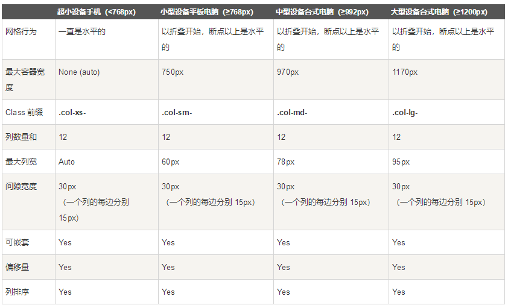

## 附.Bootstrap栅格系统

### Bootstrap栅格(网格)系统

#### Bootstrap栅格系统概述

Bootstrap提供了一套响应式、移动设备优先的流式栅格系统，随着屏幕或视口（viewport）尺寸的增加，系统会自动分为最多12列。

#### 什么是 Bootstrap 网格系统（Grid System）

- Bootstrap 官方文档中有关网格系统的描述：

  Bootstrap 包含了一个响应式的、移动设备优先的、不固定的网格系统，可以随着设备或视口大小的增加而适当地扩展到 12 列。它包含了用于简单的布局选项的预定义类，也包含了用于生成更多语义布局的功能强大的混合类。

- 让我们来理解一下上面的语句。Bootstrap 3 是移动设备优先的，在这个意义上，Bootstrap 代码从小屏幕设备（比如移动设备、平板电脑）开始，然后扩展到大屏幕设备（比如笔记本电脑、台式电脑）上的组件和网格。

#### 移动设备优先策略

- 内容

  - 决定什么是最重要的
  - 布局

- 优先设计更小的宽度

  - 基础的 CSS 是移动设备优先，媒体查询 是针对于平板电脑、台式电脑
  - 渐进增强

- 随着屏幕大小的增加而添加元素

- 响应式网格系统随着屏幕或视口（viewport）尺寸的增加，系统会自动分为最多 12 列。

  

一个网页宽度被均分为12份，相当于有12列，当有很多行时，可以想象成一张表格。网格系统就是在这样的基础上进行操作的，所以在一般情况下，一行若有多个元素，则要求这些元素的总列数为12行。

#### Bootstrap 网格系统（Grid System）的工作原理

网格系统通过一系列包含内容的行和列来创建页面布局。

- 行必须放置在`.container` class内，以便获得适当的对齐（alignment）和内边距（padding）。
- 使用行`.row`来创建列的水平组。
- 内容应该放置在列内，且唯有列可以是行的直接子元素。
- 预定义的网格类，比如.row和`.col-xs-4`，可用于快速创建网格布局。LESS混合类可用于更多语义布局。
- 列通过内边距（padding）来创建内容之间的间隙。该内边距是通过.rows上的外边距（margin）取负，表示第一列和最后一列的行偏移。
- 网格系统是通过指定您想要横跨的十二个可用的列来创建的。例如，要创建三个相等的列，则使用三个.col-xs-4。

#### 网格选项

下表总结了 Bootstrap 网格系统如何跨多个设备工作：

 

##### 4种屏幕

- LG(large:大)：大屏幕。1200px <= width

- MD(medium:中等)：中等屏幕。992px <= width < 1200px

- SM(small:小)：小屏幕。768px <= width < 992px

- XS(maxsmall:超小)：超小屏幕。 width<768px

##### 布局

###### 布局一(`container`)

实际布局中经常会使用:

```html
<div class=”container”></div>

<!--
container的作用：
LG：大屏幕。台式机。1200px <= width。Container宽度为1170px
MD：中等屏幕。笔记本。992px <= width < 1200px。宽度为970px
SM：小屏幕。平板电脑。768px <= width < 992px。宽度为750px
XS：超小屏幕。手机。 width<768px。宽度为700px
-->
```

屏幕的左右留出一些空隙。

结合container和响应式、栅格系统

###### 布局二(`container_fluid`)

另一种最外层的样式使用container_fluid，宽度是占据整个屏幕的。随着屏幕的宽度变化而变化，**一般不建议使用**。

##### 行与列

- 使用row表示一行。一行分为12列。具体一个元素占领多少列通过col-xx-y来决定前面固定是col。

- 中间的xx表示屏幕的大小。可能的值为lg、md、sm、xs

- 后面的y表示这种屏幕下，该元素占领多少列。值为1

例：

```tex
LG：大屏幕。台式机。1200px <= width。Container宽度为1170px
MD：中等屏幕。笔记本。992px <= width < 1200px。宽度为970px
SM：小屏幕。平板电脑。768px <= width < 992px。宽度为750px
XS：超小屏幕。手机。 width<768px。宽度为700px

col-lg-3：在大屏幕情况下，该元素占3/12=1/4宽
col-md-4：在中等屏幕情况下，该元素占4/12=1/3宽
col-sm-6：在小屏幕情况下，该元素占6/12=1/2宽
col-xs-12：在超小屏幕下，该元素占12/12=100%宽
```


#### 案例

```html
<style type="text/css">
    .block {
        background: yellow;
        border: 1px solid red;
    }
</style>
```

>  注意：
>
> - FireFox中通过`Ctrl+Shift+M`切换成响应式的浏览器（宽度可拉伸）
> - 对于超小屏幕手机，如果定义了类的话，总是水平排列
> - 对于小屏幕、中等屏幕、大屏幕，开始是堆叠的，当大于规定的阈值时，会变成水平排列

##### 案例

```html
<!DOCTYPE html>
<html lang="en">
<head>
    <meta charset="UTF-8">
    <title>栅格系统</title>
    <link rel="stylesheet" type="text/css" href="assert/bootstrap/css/bootstrap.min.css"/>
    <script src="assert/js/jquery-1.11.0.js" type="text/javascript" charset="utf-8"></script>
    <script src="assert/bootstrap/js/bootstrap.min.js" type="text/javascript" charset="utf-8"></script>
    <style type="text/css">
        .block {
            background: yellow;
            border: 1px solid red;
        }
    </style>
</head>
<body>
    <div class="container">
        <!-- 这里是实际的内容 -->
        <div class="row">
            <div class="col-lg-3 col-md-4 col-sm-6 col-sm-12 block">1</div>
            <div class="col-lg-3 col-md-4 col-sm-6 col-sm-12 block">2</div>
            <div class="col-lg-3 col-md-4 col-sm-6 col-sm-12 block">3</div>
            <div class="col-lg-3 col-md-4 col-sm-6 col-sm-12 block">4</div>
            <div class="col-lg-3 col-md-4 col-sm-6 col-sm-12 block">5</div>
            <div class="col-lg-3 col-md-4 col-sm-6 col-sm-12 block">6</div>
            <div class="col-lg-3 col-md-4 col-sm-6 col-sm-12 block">7</div>
            <div class="col-lg-3 col-md-4 col-sm-6 col-sm-12 block">8</div>
            <div class="col-lg-3 col-md-4 col-sm-6 col-sm-12 block">9</div>
            <div class="col-lg-3 col-md-4 col-sm-6 col-sm-12 block">10</div>
            <div class="col-lg-3 col-md-4 col-sm-6 col-sm-12 block">11</div>
            <div class="col-lg-3 col-md-4 col-sm-6 col-sm-12 block">12</div>
        </div>
    </div>
</body>
</html>
```


##### 案例2:嵌套

在一个col-xx-y中，理论上可以嵌套另外的col-xx-y。嵌套内的列是不需要再套上`.container`

```html
<div class="container">
    <div class="row">
        <div class="col-md-9 block">
            <div class="col-md-8 block">1-8</div>
            <div class="col-md-4 block">9-12</div>
        </div>
        <div class="col-md-3 block">10-12</div>
    </div>
</div>
```


##### 案例3:左右交换

左边的列和右边的列，理论上可以进行交换

- 通过`col-xx-push-*`进行右移（push表示右移）

- 通过`col-xx-pull-*`进行左移（pull表示左移）

- 其中 * 范围是从 1 到 11，*表示移几列。

  ```html
  col-md-push-3：表示右移3列(共12列)
  col-md-pull-9：表示左移9列(共12列)
  ```

  

```html
<div class="container">
    <div class="row">
        <div class="col-md-9 col-md-push-3 block">1-9</div>
        <div class="col-md-3 col-md-pull-9 block">10-12</div>
    </div>
</div>
```


##### 案例4:隐藏与显示

通过hidden-xx进行隐藏

通过visible-xx-zz 进行显示

其中：xx表示不同的屏幕。包括xs、sm、md、lg

zz表示显示的方式。包括block、inline

```html
<div class="container">
    <div class="row">
        <div class="visible-xs-block block">超小屏幕显示</div>
        <div class="hidden-xs block">超小屏幕隐藏</div>
        <div class="visible-sm-block block">小屏幕显示</div>
        <div class="hidden-sm block">小屏幕隐藏</div>
        <div class="visible-md-block block">中等屏幕显示</div>
        <div class="hidden-md block">中等屏幕隐藏</div>
        <div class="visible-lg-block block">大屏幕显示</div>
        <div class="hidden-lg block">大屏幕隐藏</div>
    </div>
</div>

LG：大屏幕。台式机。1200px <= width。Container宽度为1170px
MD：中等屏幕。笔记本。992px <= width < 1200px。宽度为970px
SM：小屏幕。平板电脑。768px <= width < 992px。宽度为750px
XS：超小屏幕。手机。 width<768px。宽度为700px
```

