## 附.练习题

实现动态生成考题功能 （要求使用jQuery实现）

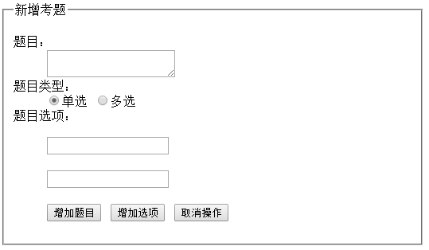 

```html
<html lang="en">
  <head>
    <meta charset="UTF-8">
    <title>新增题目</title>
  	<script type="text/javascript" src="js/jquery-1.8.3.js"></script>
  	<style type="text/css">
  		ol{
  			margin-top:2px;
  		}
  	</style>
  </head>
  <body>	
  	<form>
  		<fieldset style="width:500px">
    	<legend>新增考题</legend>
        <div id="topic">
           <dl>
			  <dt>题目：</dt>
			  <dd>
				 <textarea id="topicTitle" title="填入题目内容"></textarea>
			  </dd>
			  <dt>题目类型：</dt>
			  <dd>
			  	 <input type="radio" name="topicType" value="1" checked=checked/>单选
				 <input type="radio" name="topicType" value="2" />多选
			  </dd>
			  <dt>题目选项：</dt>
			  <dd id="topicOptions">
				  <p><input type="text" name="options" /></p>
				  <p><input type="text" name="options" /></p>
			  </dd>
			  <dt></dt>
			  <dd class="button">
				  <input type="button" id="addItem" value="增加题目" />
				  <input type="button" id="addOption" value="增加选项" />
				  <input type="reset" id="btnCancel" value="取消操作" />
			  </dd>
			</dl>
     </div>
   </fieldset>
   </form>
   <div>新增加的考题如下：</div>
   <div id="content"></div>
  </body>
</html>    
```


1. 在题目、题目选项上添加内容如下图

   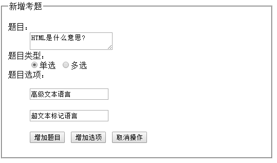 

   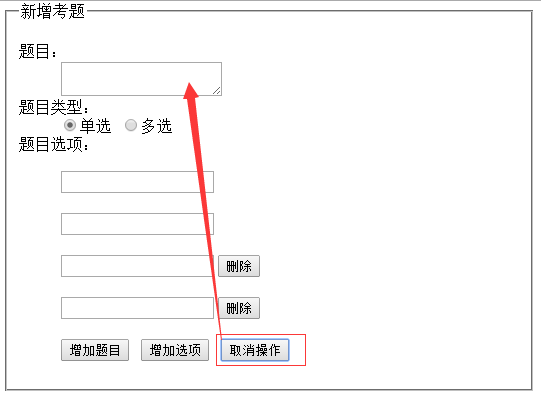 

2. 点击增加题目则在下面新增一新的考题，增加考题时必须添加题目和题目选项的非空验证，效果图如下

   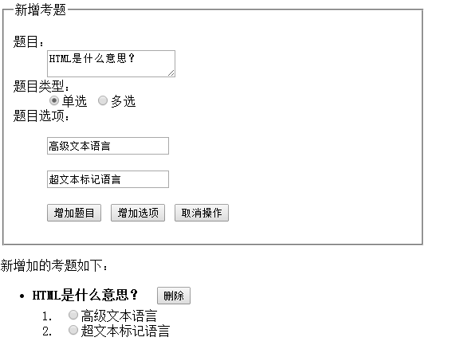 

   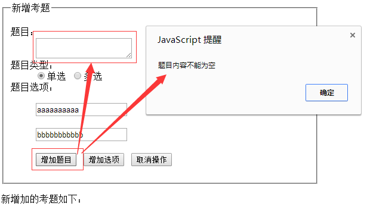 

3. 新增考题时可以添加题目选项，同时也可以删除新增的题目选项，最低必须存在2个考题选项，效果图如下

   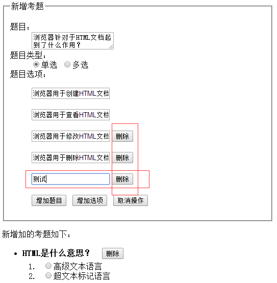 

   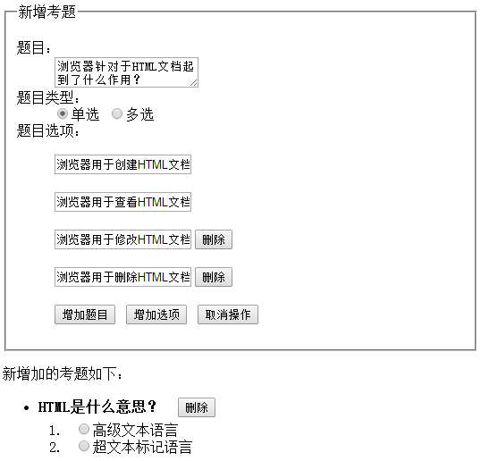 

   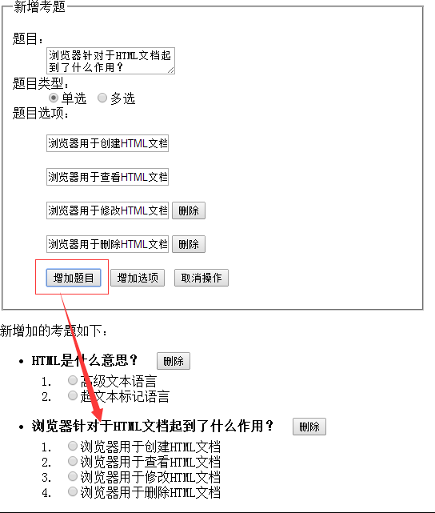 

   

   

   **增加题目按照题目类型：单选、多选生成，如下图**

   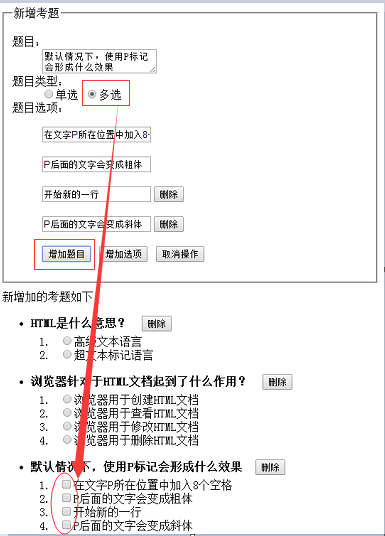 

   

4. 最后考题可以单击生成后的考题后面的删除按钮删除

   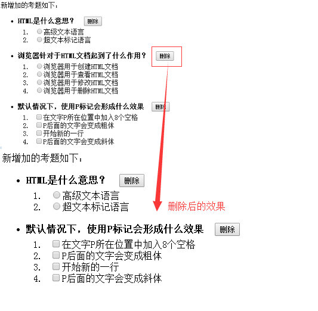 

5. 单击生成的考题可以显示或隐藏题目选项内容，效果图如下

   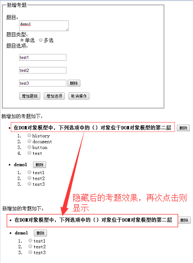 


```tex
计算得分（共25分）：
   1）初始进入的新增考题页面：3分
   2）增加题目功能：
         非空验证：3分（少一个扣1分，扣完为止）
            题目、题目选项（2~多个）
         题目增加成功：7分
   3）增加和删除选项功能：
         增加选项：2.5分
         删除选项：2.5分
   4）取消操作功能：1分
   5）已生成考题的删除功能：3分
   6）已生成考题的题目选项显示或隐藏功能：3分
```

