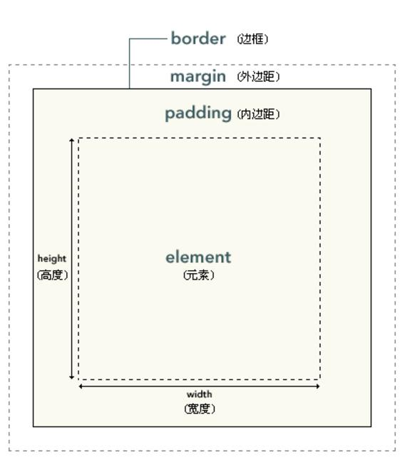

#盒子模型
## 什么是盒子模型

 - HTML div 元素是块级元素，它可用于组合其他 HTML 元素的容器。
 - div 元素没有特定的含义。除此之外，由于它属于块级元素，浏览器会在其前后显示折行。
 - 如果与 CSS 一同使用，div 元素可用于对大的内容块设置样式属性。
 - div 元素的另一个常见的用途是文档布局。它取代了使用表格定义布局的老式方法。

## 盒子模型的概念
 - CSS 框模型 (Box Model) 规定了元素框处理元素内容、内边距、边框和 外边距的方式。




# 定位
 - CSS 定位 (Positioning) 属性允许你对元素进行定位。
定位的基本思想很简单，它允许你定义元素框相对于其正常位置应该出现的位置，或者相对于父元素、另一个元素甚至浏览器窗口本身的位置。

 - CSS 定位机制
CSS 有三种基本的定位机制：普通流(相对定位)、浮动和绝对定位。
除非专门指定，否则所有框都在普通流中定位。也就是说，普通流中的元素的位置由元素在 (X)HTML 中的位置决定。
块级框从上到下一个接一个地排列，框之间的垂直距离是由框的垂直外边距计算出来。

## 相对定位
 - 相对于原有的位置发生改变，并且保留原有的空间位置。

```
<head>
    <meta charset="UTF-8">
    <title>Title</title>
    <style type="text/css">
        #one{
            border: solid red 3px;
        }
        #two{
            border: solid green 3px;
            /*相对定位*/
            position: relative;
            top:10px;
            left: 10px;
        }
        #three{
            border: solid blue 3px;
        }
    </style>
</head>
<body>
    <div id="one">第一个盒子</div>
    <div id="two">第二个盒子</div>
    <div id="three">第三个盒子</div>
</body>
```

## 绝对定位
 - 绝对定位相对于他有position属性的父级元素进行定位，如果父级元素没有postion定位，那么就找父级的父级，直到向上找到position定位为止，如果他向上找不到position定位，那么就以最外层的body进行定位。
 - 并且绝对定位不会保留原有的位置空间。

```
<head>
    <meta charset="UTF-8">
    <title>Title</title>
    <style type="text/css">
        #one{
            border: solid red 3px;
        }
        #two{
            border: solid green 3px;
            /*绝对定位*/
            position: absolute;
            top:1px;
        }
        #three{
            border: solid blue 3px;
        }
        #parent{
            position: relative;
            border: solid black 3px;
        }
    </style>
</head>
<body>
    <div id="parent">
        <div id="one">第一个盒子</div>
        <div id="two">第二个盒子</div>
        <div id="three">第三个盒子</div>
    </div>
</body>
```

## 浮动
 - 浮动可以帮助我们更好进行页面排版，使原本竖着排列的盒子可以横向排列起来。
 - 副作用：因为浮动会使元素脱离了标准的文档流，从而导致父级元素无法被撑开。
 - 解决办法：添加空盒子
在被浮动的元素后面，添加一个空的div，并且设置一个clear类，并付给该div
.clear{clear:both;}
```
<head>
    <meta charset="UTF-8">
    <title>Title</title>
    <style type="text/css">
        #one{
            border: solid red 2px;
            height: 100px;
            width: 100px;
            float: left;
        }
        #two{
            border: solid blue 2px;
            height: 100px;
            width: 100px;
            float: left;
        }
        #parent{
            border: solid green 2px;
            /*height: 100px;*/
        }
        #three{
            clear:both;
        }
    </style>
</head>
<body>
    <div id="parent">
        <div id="one">第一个盒子</div>
        <div id="two">第二个盒子</div>
        <div id="three"></div>
    </div>
</body>
```