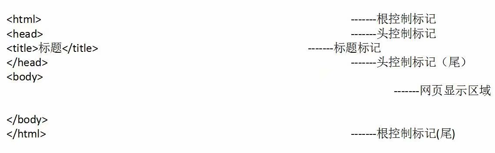

#HTML 
## 什么是 HTML
 - HTML（英文 Hyper Text Markup Language 的缩写）中文译为“超文本标记语言”，主要是通过HTML标记对网页中的文本、图片、声音等内容进行描述。
 - HTML提供了许多标记，如段落标记、标题标记、超链接标记、图片标记等，网页中需要定义什么内容，就用相应的 HTML 标记描述即可。
 - 超文本：图文并茂--视频、音频、图片、文本内容等等
 - 标记语言： 通过标签进行开发

## HTML 的结构
 

 - 补充：在head标签里面还可以设置<meta charset="UTF-8"> ，来设置编码类型