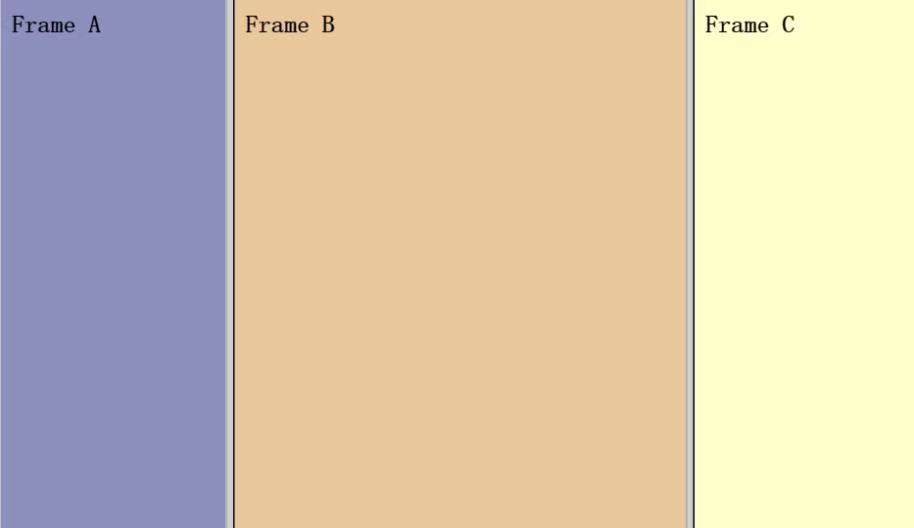
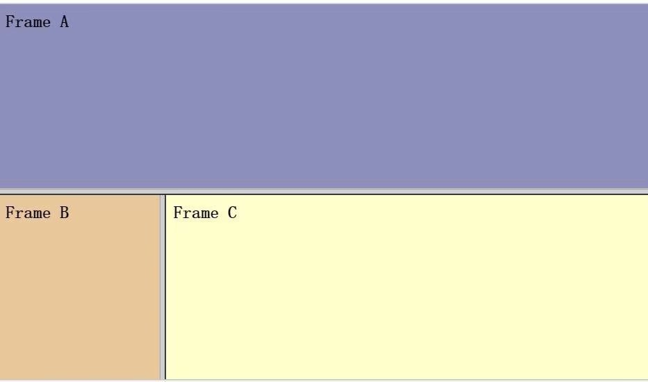

#框架标签
## 框架标签的作用
 - 通过使用框架，你可以在同一个浏览器窗口中显示不止一个页面。
 - 框架结构标签（<frameset>）定义如何将窗口分割为框架
 - 每个 frameset 定义了一系列行或列
 - rows/columns 的值规定了每行或每列占据屏幕的面积

## 框架标签的使用
 -  Frame 标签定义了放置在每个框架中的 HTML 文档。
 -  在下面的这个例子中，我们设置了一个两列的框架集。第一列被设置为占据浏览器窗口的 25%。第二列被设置为占据浏览器窗口的 75%。
 -  HTML 文档 "frame_a.htm"被置于第一个列中，而 HTML 文档 "frame_b.htm" 被置于第二个列中：

```
<frameset cols="25%,50%,*">
    <frame src="frame_a.htm">
    <frame src="frame_b.htm">
    <frame src="frame_c.htm">
</frameset>

```



- 混合框架结构
```
<frameset rows="50%,50%">
    <frame src="frame_a.htm">
    <frameset cols="25%,75%">
        <frame src="frame_b.htm">
        <frame src="frame_c.htm">
    </frameset>
</frameset>
```


## 框架标签的注意事项
 - 假如一个框架有可见边框，用户可以拖动边框来改变它的大小。为了避免这种情况发生，可以在 <frame> 标签中加入：noresize="noresize"。
 - 不能将 <body></body> 标签与 <frameset></frameset> 标签同时使用！
