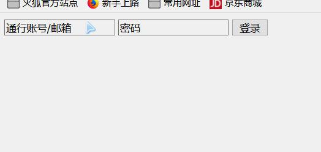
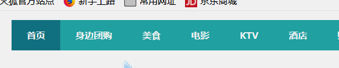
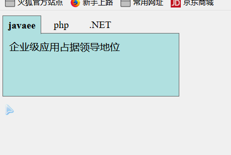
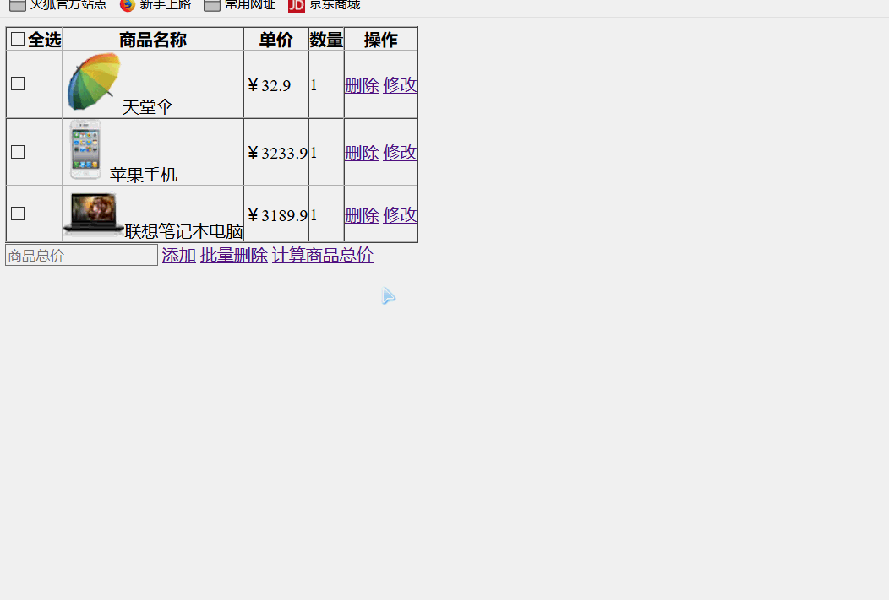

## 附.练习题

1. 登录框特效

    

   ```html
   <!DOCTYPE html>
   <html lang="en">
   <head>
       <meta http-equiv="Content-Type" content="text/html; charset=utf-8" />
       <title>登录框特效 </title>
   </head>
   <body>
   <form>
      <input type="text" name='username' class='text username' value="通行账号/邮箱" />
      <input type="text" name='passwrd' class='text passwrd' value="密码"/>
      <input type="submit" name='sub'  class='btn' value="登录"/>
   </form>
   </body>
   </html>
   ```

   

2. 使用jQuery制作团购网主导航

    

   ```html
   <!DOCTYPE html PUBLIC "-//W3C//DTD XHTML 1.0 Transitional//EN" "http://www.w3.org/TR/xhtml1/DTD/xhtml1-transitional.dtd">
   <html xmlns="http://www.w3.org/1999/xhtml">
   <head>
   <meta http-equiv="Content-Type" content="text/html; charset=utf-8" />
   <title>网站主导航</title>
   <style type="text/css">
   #menu{
   	list-style:none;
   	height:40px;
   	line-height:40px;
   	color:#fff;
   	font-weight:bold;
   	font-size:12px;
   }
   #menu li a{
   	color:#fff;
   	text-decoration:none;
   }
   #menu li{
   	display:block;
   	float:left;
   	padding:0px 20px; 
   	background-color:#2BA6A7;
   }
   #menu li.on{
   	background-color:#147B81;
   }
   </style>
   
   </head>
   <body>
       <ul id="menu">
           <li class="on"><a href="#">首页</a></li>
           <li><a href="#">身边团购</a></li>
           <li><a href="#">美食</a></li>
           <li><a href="#">电影</a></li>
           <li><a href="#">KTV</a></li>
           <li><a href="#">酒店</a></li>
           <li><a href="#">购物</a></li>
       </ul>
   </body>
   </html>
   ```

   

3. 选项卡案例

    

   ```html
   <!DOCTYPE html>
   <html lang="en">
   <head>
       <meta charset="UTF-8">
       <title></title>
       <style type="text/css">
           ul{
               margin: 0;
               padding: 0;
               list-style: none;
           }
   
           #tab li {
               text-align: center;
               float: left;
               padding: 5px;
               margin-right: 2px;
               width: 50px;
               cursor: pointer
           }
   
           #tab li.tabFocus {
               width: 50px;
               font-weight: bold;
               background-color: powderblue;
               border: solid 1px #666;
               border-bottom: 0;
               z-index: 100;
               position: relative
           }
   
           #content {
               width: 260px;
               height: 80px;
               padding: 10px;
               background-color: powderblue;
               clear: left;
               border: solid 1px #666;
               position: relative;
               top: -1px
           }
   
           #content li {
               display: none
           }
   
           #content li.contentFocus {
               display: block
           }
       </style>
   </head>
   
   <body>
   <ul id="tab">
       <li class="tabFocus">javaee</li>
       <li>php</li>
       <li>.NET</li>
   </ul>
   <ul id="content">
       <li class="contentFocus">企业级应用占据领导地位</li>
       <li>中小型网站首选</li>
       <li>微软出品</li>
   </ul>
   </body>
   </html>
   ```

   

4. jQuery节点操作-购物车

    

   ```html
   <!DOCTYPE html>
   <html lang="en">
   <head>
       <meta charset="UTF-8">
       <title>jQuery节点操作-购物车</title>
       <script src="js/jquery-1.8.3.js" type="text/javascript" charset="utf-8"></script>
       <script type="text/javascript">
           
       </script>
   </head>
   <body>
       <table border="1" cellpadding="0" cellspacing="0">
           <tr>
               <th><input type="checkbox" id="chkAll">全选</th>
               <th>商品名称</th>
               <th>单价</th>
               <th>数量</th>
               <th>操作</th>
           </tr>
           <tr>
               <td><input type="checkbox"></td>
               <td>天堂伞</td>
               <td>￥<span>32.9</span></td>
               <td>1</td>
               <td>
                   <a href="#" class="del">删除</a>
                   <a href="#" class="update">修改</a>
               </td>
           </tr>
           <tr>
               <td><input type="checkbox"></td>
               <td>苹果手机</td>
               <td>￥<span>3233.9</span></td>
               <td>1</td>
               <td>
                   <a href="#" class="del">删除</a>
                   <a href="#" class="update">修改</a>
               </td>
           </tr>
           <tr>
               <td><input type="checkbox"></td>
               <td>联想笔记本电脑</td>
               <td>￥<span>3189.9</span></td>
               <td>1</td>
               <td>
                   <a href="#" class="del">删除</a>
                   <a href="#" class="update">修改</a>
               </td>
           </tr>
       </table>
       <input type="text" placeholder="商品总价" id="priceCount" />
       <a href="#" class="add">添加</a>
       <a href="#" class="delAll">批量删除</a>
       <a href="#" class="calcPrice">计算商品总价</a>
   </body>
   </html>
   ```

   