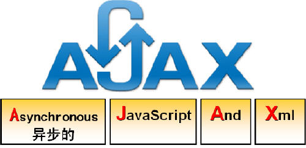
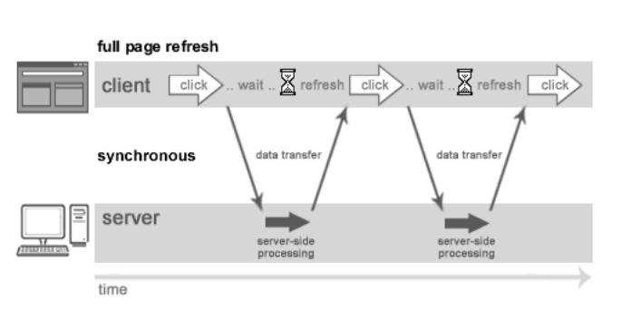
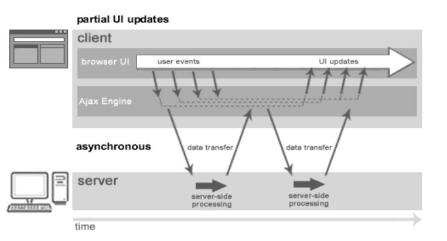

# AJAX
## 什么是AJAX

 - `Ajax`：（Asynchronous JavaScript And XML）指异步 `JavaScript` 及 `XML`
不是一种新的编程语言，而是一种用于创建更好更快以及交互性更强的 `Web` 应用程序的技术，是基于  `JavaScript`、`XML`、`HTML`、`CSS` 新用法
 - `AJAX` :只刷新局部页面的技术

## AJAX 交互
 - 传统交互模型:
 
 - AJAX交互模型:
 

## AJAX 技术点
 1. `XMLHttpRequest` 对象:
    - `XMLHttpRequest` 用于在后台与服务器交换数据。这意味着可以在不重新加载整个网页的情况下，对网页的某部分进行更新。
    - 创建方式:`var xmlHttp=new XMLHttpRequest();`
    - `XMLHttpRequest` 对象的 `open(method,url,async)` 和 `send()` 方法用于把请求发送到服务器
 2. `onreadystatechange` 事件
    - 当请求被发送到服务器时，我们需要执行一些基于响应的任务。每当 `readyState` 改变时，就会触发 `onreadystatechange` 事件。`readyState` 属性存有 `XMLHttpRequest` 的状态信息。
 3. `XMLHttpRequest` 对象的三个重要的属性

|属性|描述|
|----|----|
|onreadystatechange|	存储函数（或函数名），每当 readyState 属性改变时，就会调用该函数。|
|readyState|存有 XMLHttpRequest 的状态。从 0 到 4 发生变化。<br/>0: 请求未初始化<br/>1: 服务器连接已建立<br/>2: 请求已接收<br/>3: 请求处理中<br/>4: 请求已完成，且响应已就绪|
|status|200: "OK"<br/>404: 未找到页面|

## AJAX 案例
```java
<head>
	<meta http-equiv="Content-Type" content="text/html; charset=UTF-8">
	<title>Insert title here</title>
	<script type="text/javascript">
		onload = function(){
			var username = document.getElementById("username");
			var span = document.getElementsByTagName("span")[0];
			username.onblur = function(){
				var xmlHttp = new XMLHttpRequest();
				xmlHttp.onreadystatechange = function(){
					if(xmlHttp.readyState == 4 && xmlHttp.status == 200){
						if(xmlHttp.responseText == "1"){
							span.innerHTML = "<font color='red'>用户名已存在</font>";
						}else if(xmlHttp.responseText == "0"){
							span.innerHTML = "<font color='green'>用户名可用</font>";
						}
					}
				}
				xmlHttp.open("GET","UserServlet?action=checkUsername&username="+username.value,true);
				xmlHttp.send();
			}
		}
	</script>
</head>
<body>
	<form action="UserServlet" method="post">
		<input type="hidden" name="action" value="register"/>
		用户名:<input type="text" name="username" id= "username"/><span></span><br/>
		密码:<input type="text" name="password"/><br/>
		<input type="submit" value="注册"/>
	</form>
</body>
```