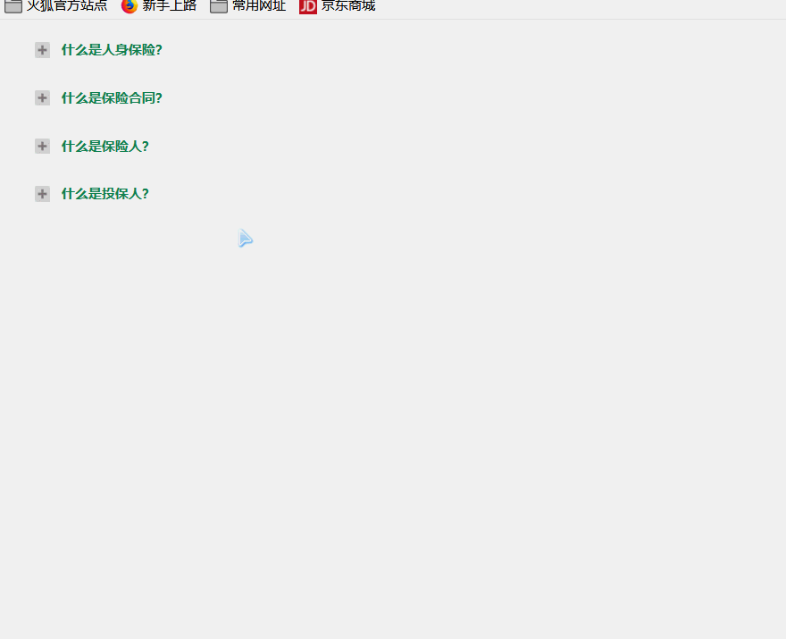
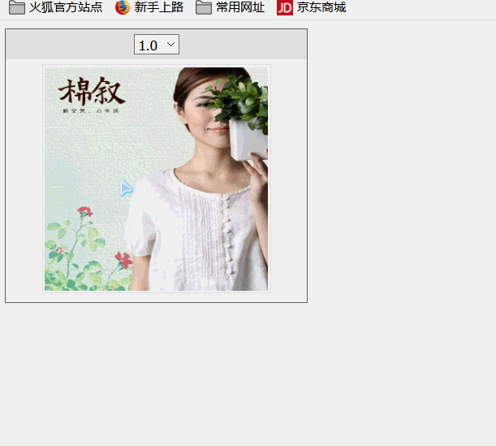

## 附.练习题

1. 制作FAQ列表项

    

   ```html
   <html xmlns="http://www.w3.org/1999/xhtml">
   <head>
   <meta http-equiv="Content-Type" content="text/html; charset=utf-8" />
   <title>FAQ列表</title>
   <style type="text/css" >
   .one{ 
   	width:600px;
   	font-size:12px;
   }
   .one .top{
   	background-color:#fff; 
   	height:33px;
   	line-height:33px;
   	width:700px;
   	padding-left:28px;
   	color:#168750;
   	font-weight:bold;
   	margin-top:10px;
   }
   .iocn{
   	display:block; 
   	width:14px;
   	height:14px;
   	background-image:url(images/+.jpg); 
   	background-repeat:no-repeat; 
   	float:left;
   	margin:10px 0px 0px 3px;
   	padding-right:10px;
   }
   .one  span.jian{
   	background-image:url(images/-.jpg);
   	 
   }
   .one  span.jia{
   	background-image:url(images/+.jpg);
   	 
   }
    
   .one  div.bgreen{ 
   	background-image:url(images/bg.jpg); 
   }
   div.content{
   	display:none;
   	padding:5px;
   	width:716px;
   	border:1px solid #D9EFED;
   }
   </style>
   </head>
   <body>
   
    <div id="fq">
    	<div class="one">
       	<div class="top"><span class="iocn"></span>什么是人身保险？</div>
           <div class="content">
           	<br/>
              <p>人身保险是人的寿命和身体为...... </p>
           </div>
       </div>
       <div class="one">
       	<div class="top"><span class="iocn"></span>什么是保险合同？</div>
           <div class="content">
           	<br/>
              <p>保险合同是......</p>
           </div>
       </div>
        <div class="one">
       	<div class="top"><span class="iocn"></span>什么是保险人？</div>
           <div class="content">
           	<br/>
              <p>保险人是......</p>
           </div>
       </div>
        <div class="one">
       	<div class="top"><span class="iocn"></span>什么是投保人？</div>
           <div class="content">
           	<br/>
              <p>投保人是......</p>
           </div>
       </div>
    </div>
   
   </body>
   </html>
   ```

   

2. 控制透明度(必做)

    

   ```html
   <!DOCTYPE html>
   <html lang="en">
   <head>
       <meta charset="UTF-8">
       <title></title>
       <style type="text/css">
           .divFrame {
               border: solid 1px #666;
               width: 297px;
               text-align: center;
           }
   
           .divFrame .divTitle {
               background-color: #eee;
               padding: 5px 0px 5px 0px
           }
   
           .divFrame .divContent {
               padding: 5px 0px 5px 0px
           }
   
           .divFrame .divContent img {
               border: solid 1px #eee;
               padding: 2px;
               width: 220px;
               height: 220px;
           }
   
       </style>
   </head>
   
   <body>
   <div class="divFrame">
       <div class="divTitle">
           <select id="Select1">
               <option value="0.2">0.2</option>
               <option value="0.4">0.4</option>
               <option value="0.6">0.6</option>
               <option value="0.8">0.8</option>
               <option value="1.0" selected="selected">1.0</option>
           </select>
       </div>
       <div class="divContent">
           
       </div>
   </div>
   </body>
   </html>
   ```

   

3. 使用jQuery Ajax将商品对象以json格式的形式返回到客户端，并在浏览器中显示出来。

   商品详情

   ```html
   <table>
       <tr>
       	<td>姓名</td>
           <td><input id="username" /></td>
       </tr>
       <tr>
       	<td>年龄</td>
           <td><input id="age" /></td>
       </tr>
   </table>
   ```

   