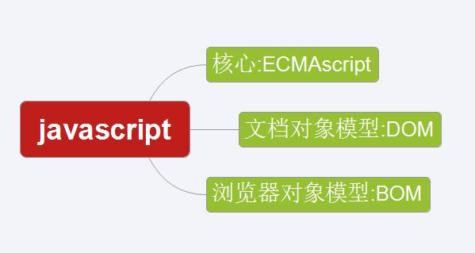

# javaScript 的介绍 
## 什么是 javaScript
 - JavaScript 是基于对象和事件驱动的脚本语言，主要是嵌入到HTML中，应用在客户端，动态操作网页元素，也可以作用于服务端。 
 - 特点:交互性（表单校验，信息提示，动态数据图表，ajax异步提交，解析服务端响应数据等等）
安全性（不可以直接访问本地硬盘）
跨平台性（由浏览器解析执行，和平台无关）

## javaScript 的作用
JavaScript 是 web 开发者必学的三种语言之一：
 - HTML 定义了网页的内容
 - CSS 描述了网页的布局
 - JavaScript 网页的行为

## Java Vs JavaScript
 - JavaScript 和 Java 是完全不同的语言，不论是概念还是设计。

 - JavaScript 在 1995 年由 Brendan Eich 发明，并于 1997 年成为一部 ECMA 标准。
 JavaScript只需浏览器解析就可以执行，而java需要先编译成字节码文件，然后通过JVM来执行。
 - JavaScript 是一种弱类型语言，java是强类型语言。
 - 强类型：类型具有规范化：int、float、double、long...Student(对象类型)
 - 弱类型:  定义值的时候var类型，执行时才确定不同类型

## JavaScript的组成
 - 一个完整 JavaScript实现由以下3个部分组成

