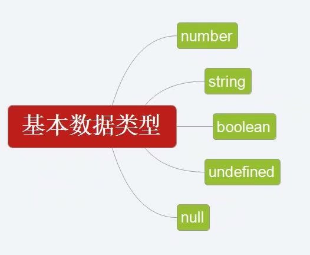

# javaScript 的基本语法 
## JavaScript 的语法
 - JavaScript  是一个程序语言。语法规则定义了语言结构。
 - 在编程语言中，一般固定值称为字面量，如 3.14。
 - 数字（Number）字面量 可以是整数或者是小数，或者是科学计数(e)。

## <script> 标签
 - 如需在 HTML 页面中插入 JavaScript，请使用 <script> 标签。
 - <script> 和 </script> 会告诉 JavaScript 在何处开始和结束。
 - <script> 和 </script> 之间的代码行包含了 JavaScript:
```
    <script>
        alert("Hello World");
    </script>
```

## JavaScript 变量
 - JavaScript 使用关键字 var 来定义变量， 使用等号来为变量赋值：

```
    // 使用小数点来写
    var x1=34.00;
    // 不使用小数点来写
    var x2=34;
    // 浏览器控制台打印
    console.log(x1);
    console.log(x2);
```
注:定义的变量是没有数据类型，只有在赋值后才有数据类型


## JavaScript 变量的生命周期
 - JavaScript 变量的生命期从它们被声明的时间开始。
 - 局部变量会在函数运行以后被删除。
 - 全局变量会在页面关闭后被删除。

## JavaScript 的数据类型
 - 值类型(基本类型)：字符串（String）、数字(Number)、布尔(Boolean)、对空（Null）、未定义（Undefined）、Symbol。
 - 引用数据类型：对象(Object)、数组(Array)、函数(Function)。
 - JavaScript 拥有动态类型。这意味着相同的变量可用作不同的类型。

